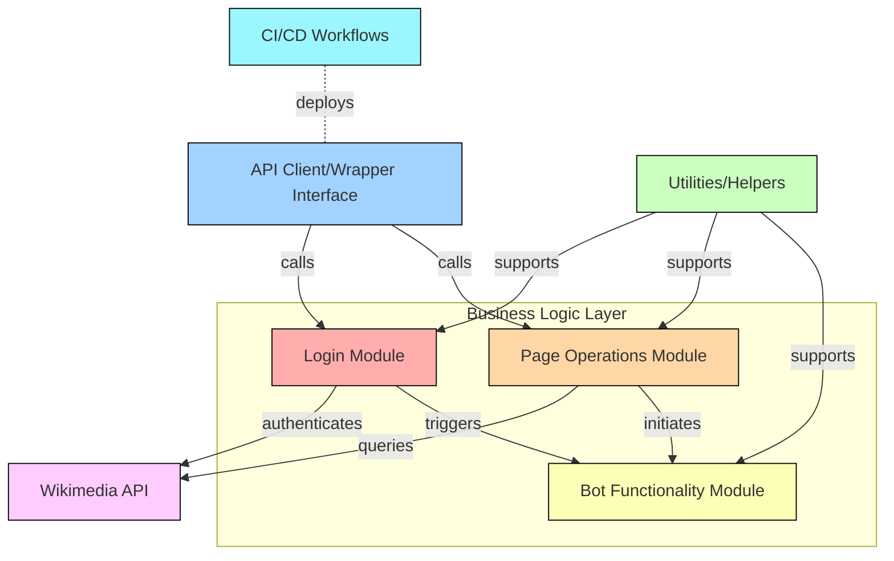

```mermaid
flowchart TD
    APIClient["API Client/Wrapper Interface"]:::api
    subgraph "Business Logic Layer"
        LoginModule["Login Module"]:::login
        PageOps["Page Operations Module"]:::page
        BotModules["Bot Functionality Module"]:::bot
    end
    Utilities["Utilities/Helpers"]:::util
    External["Wikimedia API"]:::external
    CICD["CI/CD Workflows"]:::cicd

    %% Data Flow Connections
    APIClient -->|"calls"| LoginModule
    APIClient -->|"calls"| PageOps
    LoginModule -->|"authenticates"| External
    PageOps -->|"queries"| External
    LoginModule -->|"triggers"| BotModules
    PageOps -->|"initiates"| BotModules
    Utilities -->|"supports"| LoginModule
    Utilities -->|"supports"| PageOps
    Utilities -->|"supports"| BotModules
    CICD -.-|"deploys"| APIClient

    %% Click Events for API Client/Wrapper Interface
    click APIClient "https://github.com/wikiar/newapi/blob/main/README.md"
    click APIClient "https://github.com/wikiar/newapi/blob/main/ __init__.py"

    %% Click Events for Login Module
    click LoginModule "https://github.com/wikiar/newapi/blob/main/super/super_login.py"
    click LoginModule "https://github.com/wikiar/newapi/tree/main/super/login_bots/"

    %% Click Events for Page Operations Module
    click PageOps "https://github.com/wikiar/newapi/blob/main/page.py"
    click PageOps "https://github.com/wikiar/newapi/blob/main/wiki_page.py"
    click PageOps "https://github.com/wikiar/newapi/blob/main/mdwiki_page.py"
    click PageOps "https://github.com/wikiar/newapi/blob/main/ncc_page.py"
    click PageOps "https://github.com/wikiar/newapi/tree/main/super/page_bots/"

    %% Click Events for Bot Functionality Modules
    click BotModules "https://github.com/wikiar/newapi/blob/main/botEdit.py"
    click BotModules "https://github.com/wikiar/newapi/blob/main/db_bot.py"
    click BotModules "https://github.com/wikiar/newapi/blob/main/pymysql_bot.py"
    click BotModules "https://github.com/wikiar/newapi/tree/main/super/botapi_bots/"
    click BotModules "https://github.com/wikiar/newapi/tree/main/super/bots/"

    %% Click Events for Utility and Helper Functions
    click Utilities "https://github.com/wikiar/newapi/blob/main/except_err.py"
    click Utilities "https://github.com/wikiar/newapi/blob/main/pformat.py"
    click Utilities "https://github.com/wikiar/newapi/blob/main/printe.py"
    click Utilities "https://github.com/wikiar/newapi/blob/main/txtlib.py"
    click Utilities "https://github.com/wikiar/newapi/blob/main/wd_sparql.py"

    %% Click Event for CI/CD Workflows
    click CICD "https://github.com/wikiar/newapi/tree/main/.github/"

    %% Styles
    classDef api fill:#a2d2ff,stroke:#000,stroke-width:1px;
    classDef login fill:#ffadad,stroke:#000,stroke-width:1px;
    classDef page fill:#ffd6a5,stroke:#000,stroke-width:1px;
    classDef bot fill:#fdffb6,stroke:#000,stroke-width:1px;
    classDef util fill:#caffbf,stroke:#000,stroke-width:1px;
    classDef cicd fill:#9bf6ff,stroke:#000,stroke-width:1px;
    classDef external fill:#ffccff,stroke:#000,stroke-width:1px;
```
